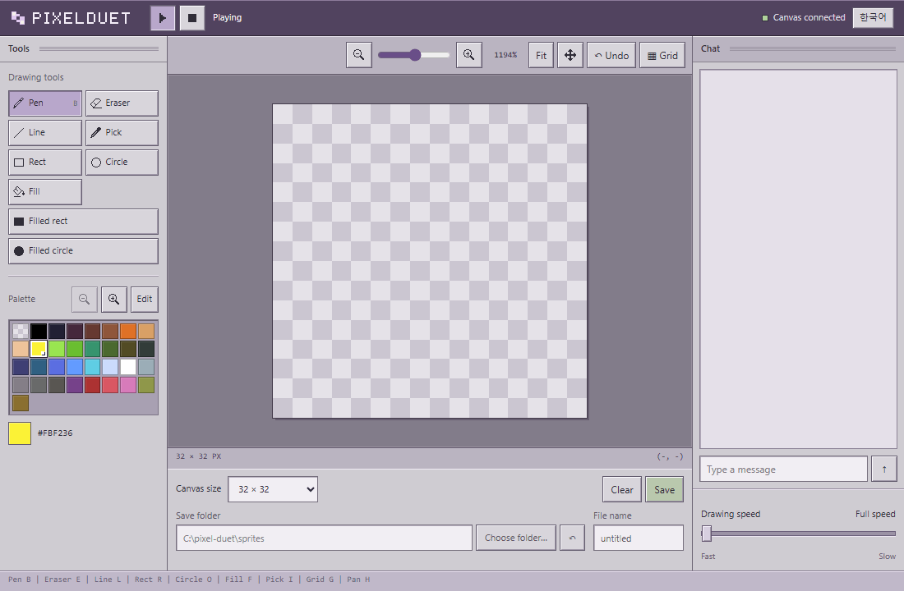

# pixelduet

[한국어](README.ko.md)

A pixel canvas shared by a model and a person. The model draws stroke
by stroke while you watch in the browser. Pause it, take the brush,
change things, leave a note, and hand the brush back. The reply to its
next stroke tells it what you did.

## Install

    npx -y pixelduet version

or

    go install github.com/kimjungminn24/pixel-duet@latest

or download a binary from the Releases page. Linux, macOS and Windows.

## Quick start

    npx -y pixelduet

starts the canvas server and the browser viewer and opens the viewer.

Connect Claude Code once:

    claude mcp add pixelduet -- npx -y pixelduet bridge

If nothing is running when a session starts, the bridge starts the
servers itself.

In a checkout of this repository, `go run .` replaces `npx -y pixelduet`
and Claude Code picks the bridge up from `.mcp.json`.

## Other MCP clients

The bridge is an MCP server over stdio. Codex CLI:

    codex mcp add pixelduet -- npx -y pixelduet bridge

or in `~/.codex/config.toml`:

    [mcp_servers.pixelduet]
    command = "npx"
    args = ["-y", "pixelduet", "bridge"]

On Windows use `command = "cmd"` and `args = ["/c", "npx", "-y", "pixelduet", "bridge"]`.

Two things to check with a new client:

- The drawing rules are sent as the server's `instructions`. If the
  client drops them, `npx -y pixelduet rules >> AGENTS.md` restores them.
- `get_canvas` returns a PNG. A client that does not pass images through
  leaves the model with `read_pixels` digits only.

Without MCP, anything that can open a TCP socket can draw. The protocol
is in internal/proto/proto.go.

## The handoff

1. The model draws one stroke per call and narrates in the log.
2. You press pause. The model's next stroke is held.
3. You edit pixels, pick colors, leave a note. Your edits never wait.
4. You press resume. The held stroke lands and its reply says:

       ok changed=1 waited=12s edits=5 box=9,8-13,10 note=make the eyes bigger

5. The model reads the canvas, keeps your edits, and continues.

## Talking

Type into the box under the log at any time.

- While the model is drawing, your words arrive on the reply to its
  next stroke.
- When it has nothing to draw, it calls `listen`, which returns when
  you say something.

Notes queue up in order. The model answers in the same log with `say`.

## The viewer

| | |
|---|---|
| Tools | pen B, eraser E, line L, rect R, circle O, filled rect U, filled circle P, fill F, pick I |
| Canvas | zoom slider, fit, pan H or Space+drag, pixel grid G, undo Ctrl+Z, size 32/64/128 |
| Palette | 32 DB32 slots; edit a slot and every pixel using it changes |
| Model | play/pause, a speed slider that adds up to 3s between strokes |
| Save | to the server's gallery folder, or to a folder you pick (Chrome, Edge) |
| Language | Korean or English, following the browser; a header button switches; `?lang=en` forces one |

## What the model gets

- `get_canvas`: the canvas as a PNG, whole or a region, plus a count
  of pixels that differ from their mirror image.
- `read_pixels`: a region as digits, or as run-length rows when shorter.
- `draw_pixels`, `draw_line`, `draw_rect`, `draw_ellipse`, `fill_area`,
  each with `mirror` to paint the reflection across the center line.
- `shade`, `highlight`, `outline`, `dither`: finishing passes on what
  is already painted.
- `list_sprites`, `view_sprite`, `save_sprite`, `stamp`: a gallery of
  saved grids in `sprites/`.
- `say`, `listen`: the chat.
- Drawing rules, sent on connect: plan proportions in numbers,
  silhouette first, check the picture after every step, one light
  source, ask before going on. See internal/bridge/rules.go.

## How it fits together

    pixelduet serve            owns the canvas
      |- pixelduet web         browser <-> HTTP/SSE <-> line protocol
      `- pixelduet bridge      MCP client <-> tools <-> line protocol

`pixelduet` alone runs serve and web in one process. The bridge does
the same when no server answers.

The canvas is a grid of palette indices, one character per pixel
(`0` empty, `1`-`w` colors), the same on the wire, in save files, and
in what the model reads. The viewer is HTML, CSS and ES modules under
internal/web/static/, embedded in the binary.

## Tests

    go test ./...
    node --test test/*.test.mjs

See [CONTRIBUTING.md](CONTRIBUTING.md).

## License

MIT. See [LICENSE](LICENSE).
